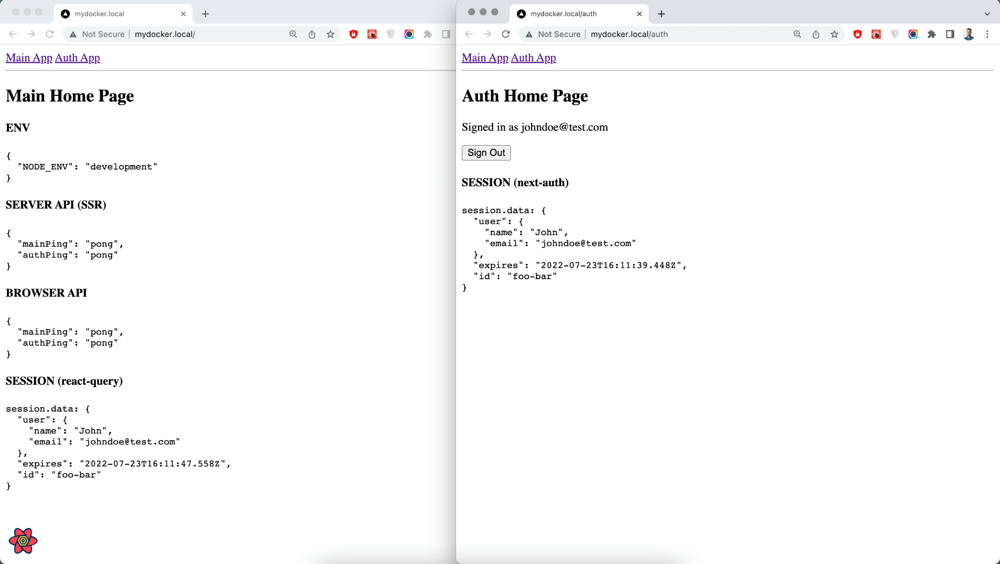

# Microservices

**WIP.** Experimental sandbox of a fullstack web project with a microservice / microfrontend architecture.

Supported OS': Linux, MacOS 

## Preview



## Setup

```
$ make init             -- update "/etc/hosts", run once
$ make install          -- install all dependencies
$ make seed             -- seed the database
$ make dev / make start -- run the whole system in dev/prod modes
```

## After Setup

```
"main" app
GET mydocker.local
GET mydocker.local/api/ping

"auth" app
GET mydocker.local/auth/
GET mydocker.local/auth/api/ping
```

## Tools

- Docker
- Docker-Compose
- ESlint
- JWT
- Make
- NextJS
- Next-Auth
- Nginx
- NodeJS
- React
- React-Query
- Yarn


## Features

- [x] Gateway proxy with Nginx
- [x] Working live reload
- [x] Multi-Stage Dockerfile builds
- [x] Authentication example with Next-Auth (`CredentialsProvider`)
- [x] Next-Auth session fetched by React-Query
- [ ] Prod deploy (DGO, AWS EC2)
- [ ] Gitlab CI/CD (move repo)
- [ ] "Scalable" version with K8s, etc.

---


